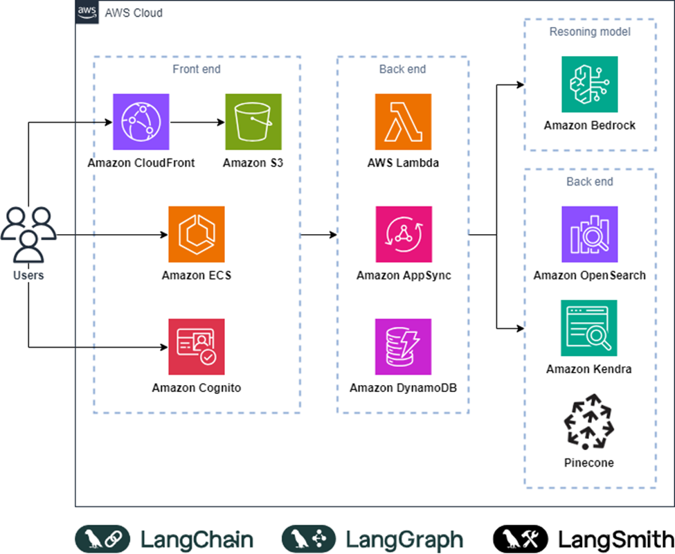

<h1 align="center">Interactive Chatbot System</h1>

## 1. Overview

Your customer requires a solution for an interactive chatbot that can chat with documents. The task is to build a Retrieval-Augmented Generation (RAG) chatbot on AWS. The chatbot will answer user queries based on a provided context document (attached in the email), while also maintaining the history of the conversation. Additionally, user authentication will be handled via AWS Cognito. 

You can use the following image as a reference architecture. Feel free to adjust the components as necessary to align with the requirements.

## 2. Functional Requirements
- **Level 100**:
    - 2.1. Chatbot functionality
        - The chatbot must answer queries based on the source document (PDF file), ensuring no hallucination.
        - It should maintain conversation history to provide a coherent interaction.
        - The solution must be built on a RAG (Retrieval-Augmented Generation) architecture.
        - The accuracy of the chatbot will be verified during the interview process.
    - 2.2. Knowledgebase management
        - Users must be able to upload additional documents.
        - There should be functionality to sync these documents within the knowledge base.
    - 2.3. User authentication
        - The user must authenticate with AWS Cognito before they can interact with a chatbot

- **Level 200**:
    - 2.4. Chatbot functionality
        - The chatbot should support response streaming.
    - 2.5. Operation features
        - The system must have functionality to trace and monitor conversation history, including data such as token usage, latency,...
        - Infrastructure as Code (IaC) should be used to deploy and manage the solution on AWS, with AWS CDK recommended.

- **Level 300**:
    - Upgrade the chatbot to a React Agent level, allowing it to take additional actions. For example:
        - If information is not found in the document, the chatbot should search the internet,...
        - The chatbot can call external APIs to retrieve dynamic information, such as the current weather,...
    - Recommended tools: LangChain, LangGraph, Talivy Search,..
